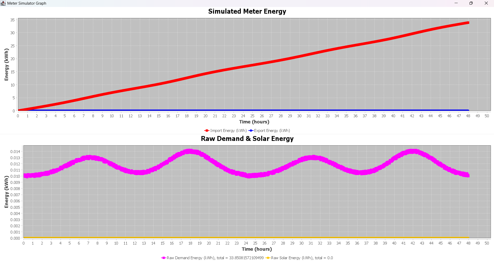
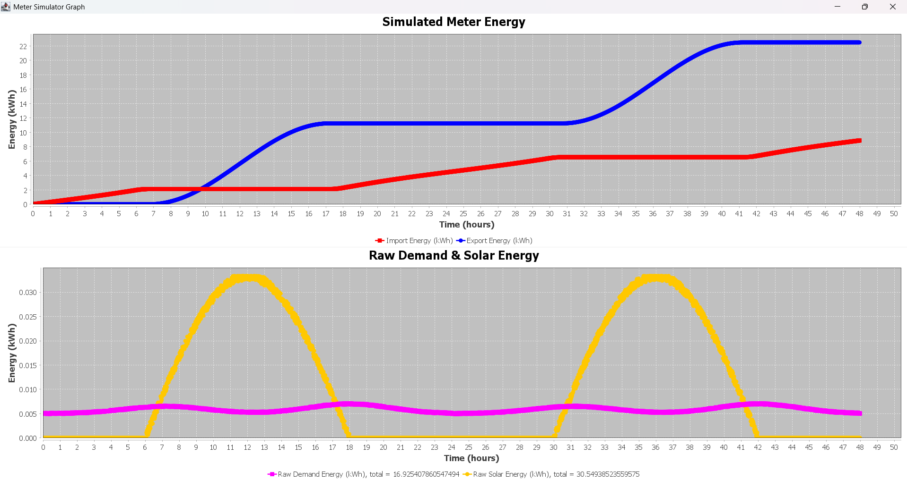
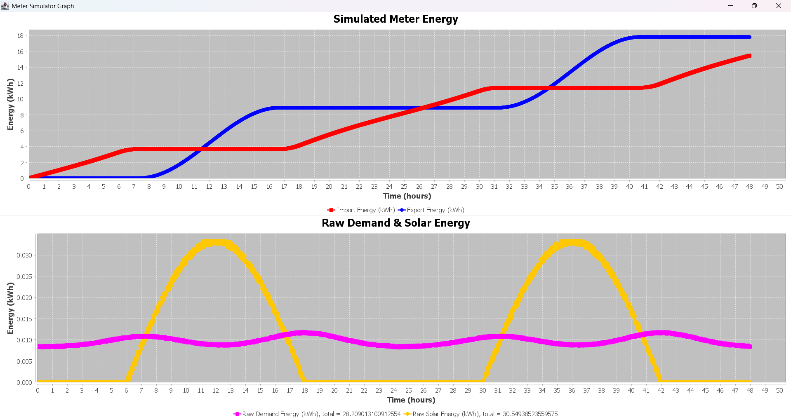

# Net P2P Energy Trading Microgrid

This project is a net metering + peer-to-peer (P2P) energy trading simulation for a residential microgrid. It models how 
houses with different consumption and generation profiles interact with each other and with the main grid under various 
energy trading policies.

## What is Net Metering?
Net Metering is a billing mechanism that lets consumers who generate their own electricity (usually using solar panels) 
send excess electricity to the grid and get credited for it.

How it works:

- When solar panels produce more power than usage, the extra energy is exported to the grid.
- When consumption is higher than generation, energy is imported from the grid.
- The electricity meter keeps track of both import and export.
- At the end of the billing period, one pays for the net energy (energy imported - energy exported).

## What is P2P Energy Trading?
P2P energy trading allows electricity consumers and producers within a local area (microgrid) to trade energy directly 
with each other  instead of relying entirely on a central utility grid.

Participants may be:

- Consumers – only consume energy
- Producers – generate surplus energy (e.g., solar PV)
- Prosumers – both consume and generate energy

The grid acts as a backup, not the first option.

<figure>
  
  <figcaption style="text-align: center;">Figure 1: Sample meter reading of a consumer</figcaption>
</figure>

<figure>
  
  <figcaption style="text-align: center;">Figure 2: Sample meter reading of a producer</figcaption>
</figure>

<figure>
  
  <figcaption style="text-align: center;">Figure 3: Sample meter reading of a prosumer</figcaption>
</figure>

## Modeling Net Metering with P2P Trading
To combine net metering and peer-to-peer energy trading in a single coherent framework, the microgrid is modeled as a set of interacting houses operating over discrete time intervals.

At each interval, every house locally accounts for its energy production, consumption, and historical grid interaction. Based on this accounting, houses may expose surplus energy for local sale or express a deficit to be satisfied by other participants.

The following section formally defines the system model, per-house energy accounting, and the market-clearing mechanism used to enable fair and efficient P2P energy exchange while preserving net-metering constraints.

## System Model
Consider a microgrid consisting of a set of houses:

H = { h1, h2, ..., hN }

Each house may simultaneously:
- consume electrical energy
- generate electrical energy (eg. rooftop solar panels)
- participate in local P2P trading
- exchange residual energy with the utility grid

Time is discretized into fixed-length intervals t.

## Per-House Energy Accounting (Energy Snapshot)
For each house h and interval t, an Energy Snapshot is computed using the following parameters:
- Interval production: Pht
- Interval consumption: Cht
- Selling price (ask): phsell
- Cost price (bid): phbuy
- Sell threshold: θh
- Historical net grid consumption from previous intervals

## Threshold-Based Grid Commitment
A fixed minimum quantity of generated energy is exported to the grid each time interval. This is to ensure that a user
can use the excess energy generated to compensate for grid imports in the future if needed.

$$G_{h,export}^{threshold}$$